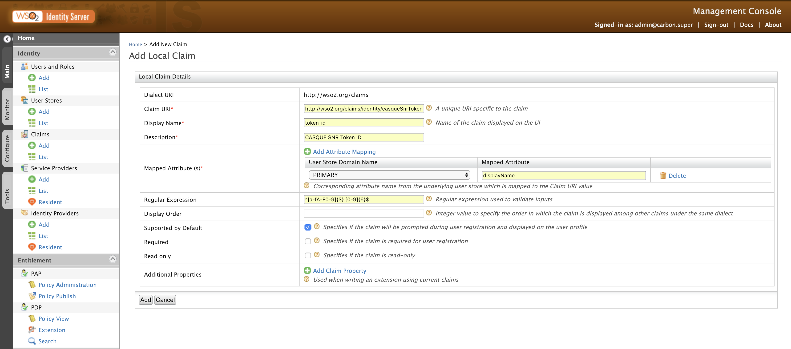
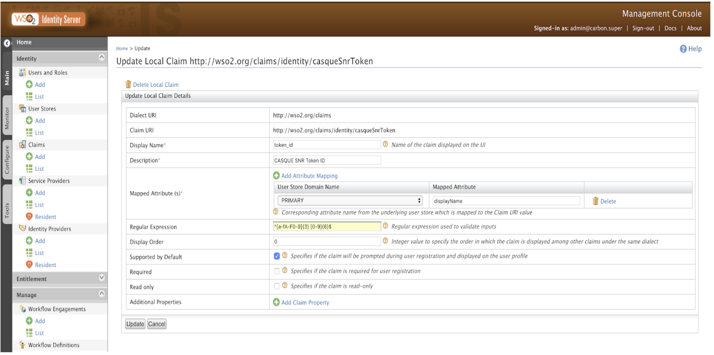
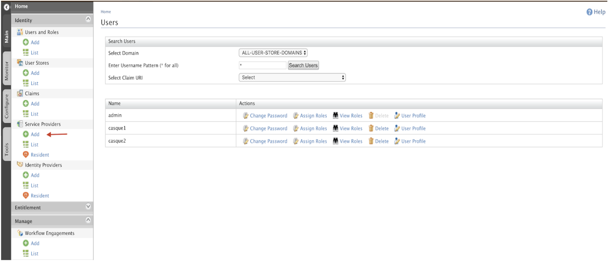
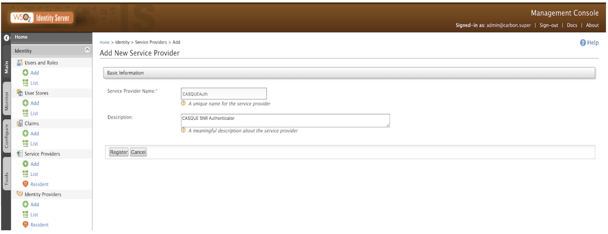
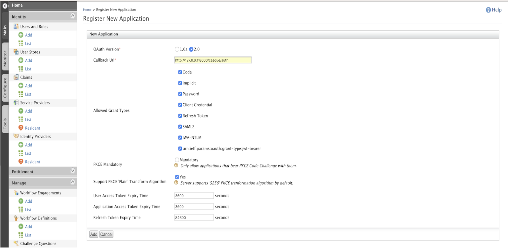
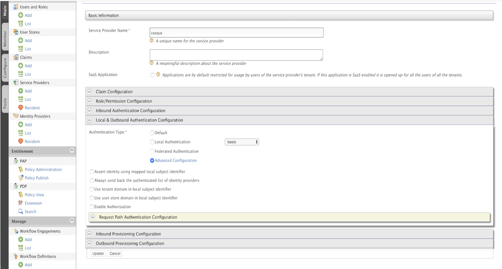

# CASQUE SNR Multi-factor Authenticator

WSO2 Identity Server is integrated to CASQUE SNR Multi-factor Authentication
Technology. 

The technology is based on a Challenge-Response protocol with the User having a hand held secure Token that calculates the response to a challenge after the User enters their credentials. There are many different Token forms including Optical, USB Tokens, Contact and Contactless Smartcard and Surrogate Tokens. All have the same highest level Secure processor chips rated at EAL6. There are options for Client and Client-less architectures.

The CASQUE SNR integration with WSO2 provides universal High Grade Identity Assurance to a Cloud of Web Application Services. This means the User determines who can access their data resources on the Cloud even if these are distributed on diverse Cloud Platforms. 
CASQUE SNR Tokens can be completely refreshed (unlike existing OTP Tokens) allowing re-use so can offer Identity as a Service to Managed Service Providers.

# Prerequisites

[Distributed Management Systems (DMS)](http://www.casque.co.uk/) is the developer of the CASQUE SNR Technology and DMS or its Systems Integrator will supply the full CASQUE SNR System which comprises SAS software to initially populate the Tokens, a batch of "blank" Tokens and the CASQUE SNR Authentication Server Software for Linux or Windows Operating Systems together with CASQUE SNR Players for the desired client platforms. The SAS software enables the Customer to initially populate the blank Tokens - this means that DMS or its Systems Integrator can never be part of the security risk.There is detailed accompanying documentation that gives instruction on installation procedures and deployment options.

# Configuring CASQUE SNR Multi-factor Authenticator

This topic provides instructions on how to configure the CASQUE SNR Multi-factor Authenticator with the WSO2 Identity Server.

Download WSO2 Identity Server from the [WSO2 Identity Server](https://wso2.com/identity-and-access-management) and install it by following the instructions in the [Installing the Product](https://docs.wso2.com/display/IS540/Installation+Guide) topic.

CASQUE SNR Version 1.1.0 Multi-factor Authenticator is supported by WSO2 Identity Server from version 5.4.0.

# Deploying Artifacts

To download the CASQUE-SNR artifacts, go to CASQUE-SNR on [WSO2 Store](https://store.wso2.com/)

Artifacts contains org.wso2.carbon.identity.casque.authenticator_1.1.0.jar 
(The jar can generate by casque_authenticator, you can find this in casque_authenticator/component/org.wso2.carbon.identity.casque.authenticator/target),casque.war and casque.conf

1. Copy the connector (org.wso2.carbon.identity.casque.authenticator_1.1.0.jar) into <IS_HOME>/repository/components/dropins directory.
2. Copy the casque.war into <IS_HOME>/repository/deployment/server/webapps directory.
3. Copy the casque.conf into <IS_HOME>/repository/conf directory.

## Set claims

This topic provides Instructions to set up a mapped claim for the CASQUE SNR Authenticator feature.

1. In the Management console Click Add under the Claims.
2. Click Add Local Claim.

    

3. Insert the followings

    Claim URI	 -	http://wso2.org/claims/identity/casqueSnrToken

    Description	-	CASQUE SNR Token ID

    Mapped Attribute(s)	- PRIMARY   displayName 

    If displayName is in use then map to another attribute.

    

4. Click Add.
5. Now edit token_id from the list as follows.

        Regular Expression	^[a-fA-F0-9]{3} [0-9]{6}$
        Supported by Default   true

        

6. Now edit displayName (or the other attribute you chose) from the list as follows.
    
        Regular Expression	^[a-fA-F0-9]{3} [0-9]{6}$
        Supported by Default   true

     

      
     
7. Click Update

## CASQUE SNR configuration

Edit the “casque.conf” in the <IS_HOME>/repository/conf directory to associate the IP Address, Port and Secret of the accompanying CASQUE SNR Authentication Server. 
Now restart the WSO2 IS Server.

## USER configuration 

1. Go to the Users and Roles section tab under the Main then click Add.
2. Add User eg : “casque1” with a password.

    

    

3. Click Finish.
4. Now go to the casque1 User Profile.
    Add the token_id that is allocated to User casque1.
    Add First Name and Email.

    

5. Click Update	

## Service Provider Configuration 

1. In the Identity section under the Main tab, click Add under Service Providers.

2. Add a name and description, e.g.
        CASQUEAuth
        CASQUE SNR Authenticator

        

3. Click Register.
4. Expand Inbound Authentication Configuration
   Expand OAuth/OpenID Connect Configuration
   Select Configure
5. Enter callback Uri of the Relying Party e.g. Amazon  Web Services.

6. Click Add.
7. Expand Local & Outbound Authentication Configuration.
8. Select Advanced Configuration

9. Add the basic authentication as the first step and CASQUEAuth as the second step.
   Select User subject identifier from this step under basic authentication.
   Select Use attributes from this step under CASQUEAuth

   

10. Click Update. 