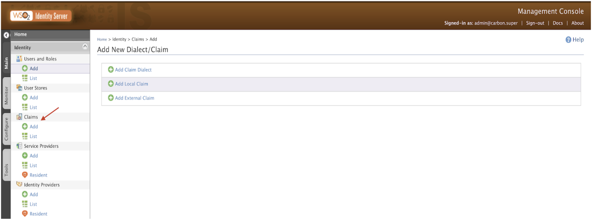
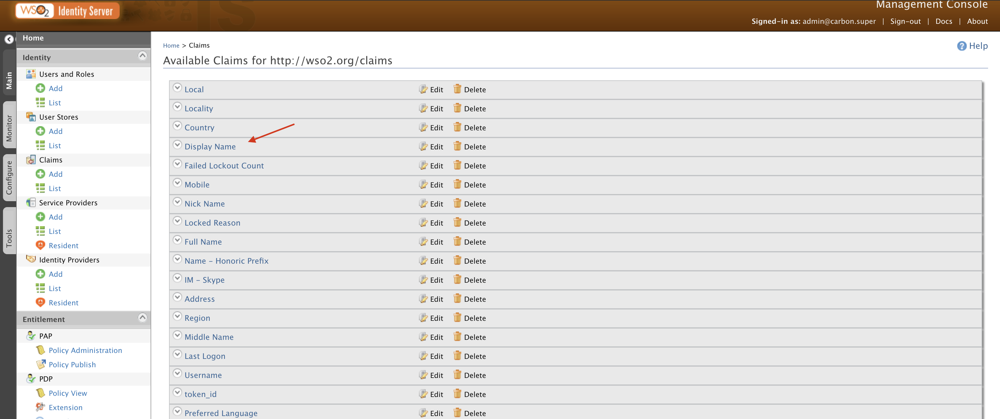
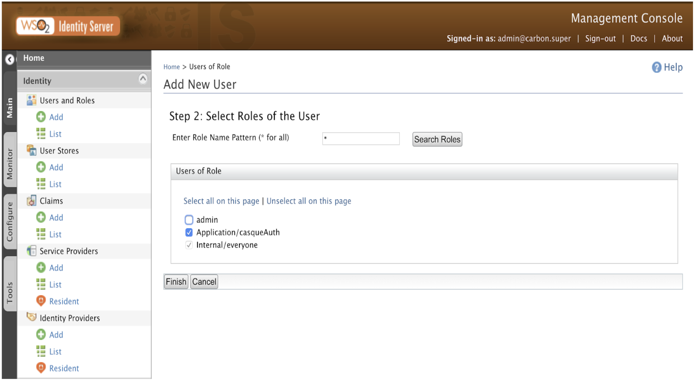
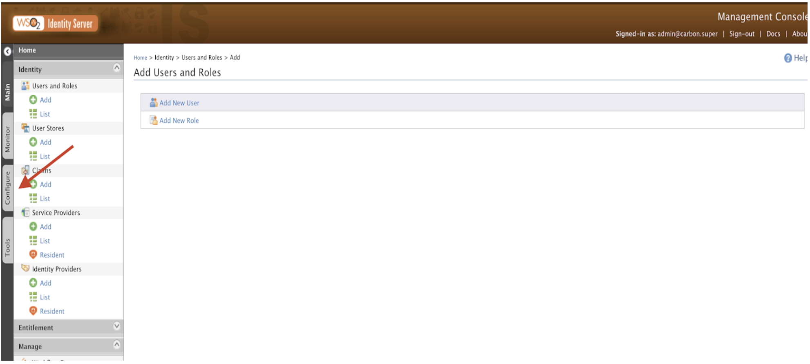
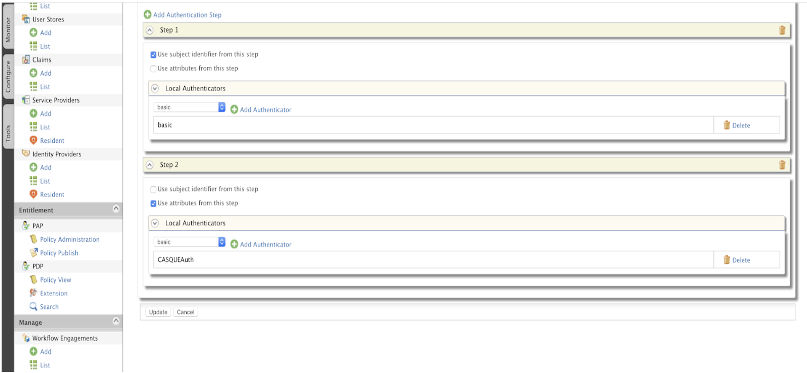

# CASQUE SNR Multi-factor Authenticator

The CASQUE SNR authenticator allows you to integrate WSO2 Identity Server with CASQUE SNR so that you can use the CASQUE SNR multi-factor authentication technology to authenticate users.

The CASQUE SNR multi-factor authentication technology is based on the challenge-response protocol where users possess a token that computes the required response to a given challenge. Tokens can be in a variety of forms such as optical, USB, contact and contactless smart-card as well as surrogate tokens. All token forms have the same highest level secure processor chips rated at EAL6. There are options for client and client-less architectures as well.

Integrating CASQUE SNR with WSO2 Identity Server provides high grade identity assurance to a cloud of Web application services. This means that even if your data is distributed across diverse cloud platforms, you get to determine who can access your data resources on the cloud. 

Unlike OTP tokens, CASQUE SNR tokens can be completely refreshed. Therefore, you can reuse tokens from a pool to provide identity as a service to managed service providers. 

Now that you understand the purpose of the CASQUE SNR authenticator, let’s have a look at how to configure the CASQUE SNR authenticator with WSO2 Identity Server to perform multi-factor authentication.

# Prerequisites

* Download [WSO2 Identity Server](https://wso2.com/identity-and-access-management) and install the product. For detailed installation instructions, see the [Installation Guide](https://docs.wso2.com/display/IS540/Installation+Guide).
>> Let's refer to the WSO2 Identity Server installation location as <IS_HOME> throughout this document.
* Get the complete CASQUE SNR system from [DMS (Distributed Management Systems)](http://www.casque.co.uk/) or its systems integrator. The complete CASQUE SNR system is required to authenticate users using the CASQUE SNR multi-factor authentication technology, and includes the following:
  * SAS software to initially populate the tokens.
  >> The SAS software allows you to initially populate the blank tokens. This ensures that DMS or its systems integrator can never be a security risk. For information on how to install and deploy the complete CASQUE SNR system, see the documentation.
  * A batch of blank tokens.
  * The CASQUE SNR authentication server software for Linux or Windows operating systems.
  * Appropriate CASQUE SNR player for the client platform.

Once you you have all the prerequisites set up, you can follow the instructions in the topics below to configure the CASQUE SNR multi-factor authenticator with the WSO2 Identity Server:

* [Downloading and deploying CASQUE SNR artifacts](#downloading-and-deploying-casque-snr-artifacts)
* [Configuring WSO2 Identity Server](#configuring-wso2-identity-server)

# Downloading and deploying CASQUE SNR artifacts

Follow the steps below to download and deploy the CASQUE-SNR artifacts:

1. Download the CASQUE SNR authenticator from [WSO2 Store](https://store.wso2.com/). This downloads the org.wso2.carbon.identity.casque.authenticator_1.1.0.jar file.
>> The CASQUE SNR authenticator version 1.1.0 is supported by WSO2 Identity Server version 5.4.0 and above.
2. Copy the org.wso2.carbon.identity.casque.authenticator_1.1.0.jar file to the <IS_HOME>/repository/components/dropins directory.
3. Copy the casque.war into <IS_HOME>/repository/deployment/server/webapps directory.
4. Copy the casque.conf into <IS_HOME>/repository/conf directory.

# Configuring WSO2 Identity Server

Follow the steps below to configure WSO2 Identity Server:

## Set claims

Follow the steps below to set up a mapped claim for the CASQUE SNR authenticator:

1. On the Management console, click **Add** under **Claims**. This displays the **Add New Dialect/Claim** screen.
2. Click **Add Local Claim**.

    

3. On the **Add Local Claim** screen, specify the followings values for the fields:

    * Claim URI	 -	http://wso2.org/claims/identity/casqueSnrToken
    * Display Name - token_id
    * Description	-	CASQUE SNR Token ID
    * Mapped Attribute(s)	- PRIMARY   displayName 
    > If the displayName attribute is already in use, you need to map another attribute.

    

4. Click **Add**.
5. Edit token_id from the list as follows.

        Regular Expression	^[a-fA-F0-9]{3} [0-9]{6}$
        Supported by Default   true

        

6. Now edit displayName (or any other attribute that you mapped) from the list as follows.
    
        Regular Expression	^[a-fA-F0-9]{3} [0-9]{6}$
        Supported by Default   true

     

      
     
7. Click Update

## CASQUE SNR configuration

Edit the “casque.conf” in the <IS_HOME>/repository/conf directory to associate the IP Address, Port and Secret of the accompanying CASQUE SNR Authentication Server. 
Now restart the WSO2 IS Server.

## USER configuration 

1. Go to the Users and Roles section tab under the Main then click Add.
2. Add User eg : “casque1” with a password.

    

    

3. Click Finish.
4. Now go to the casque1 User Profile.
    Add the token_id that is allocated to User casque1.
    Add First Name and Email.

    

5. Click Update	

## Service Provider Configuration 

1. In the Identity section under the Main tab, click Add under Service Providers.

2. Add a name and description, e.g.
        CASQUEAuth
        CASQUE SNR Authenticator

        

3. Click Register.
4. Expand Inbound Authentication Configuration
   Expand OAuth/OpenID Connect Configuration
   Select Configure
5. Enter callback Uri of the Relying Party e.g. Amazon  Web Services.

6. Click Add.
7. Expand Local & Outbound Authentication Configuration.
8. Select Advanced Configuration

9. Add the basic authentication as the first step and CASQUEAuth as the second step.
   Select User subject identifier from this step under basic authentication.
   Select Use attributes from this step under CASQUEAuth

   

10. Click Update. 

Once you complete all the configurations, you can perform user authentication with the CASQUE SNR authenticator.
